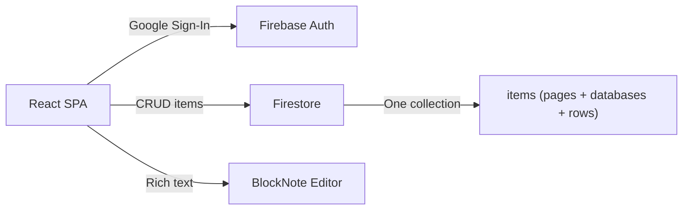

# Slate — Implementation Plan (Updated)

> A Notion-like app with pages + generic databases. Everything is an **Item**.

***

## Tech Stack

| Layer        | Choice                         |
| ------------ | ------------------------------ |
| **Build**    | Vite                           |
| **UI**       | React 18 + TypeScript          |
| **Editor**   | BlockNote                      |
| **Styling**  | Tailwind CSS v4                |
| **Auth**     | Firebase Auth (Google Sign-In) |
| **Database** | Cloud Firestore                |

***

## Architecture



**Unified model:** pages, databases, and database rows are all stored in `/users/{uid}/items/`.

***

## Phase 1: Scaffolding + Auth (~30 min)

* Scaffold Vite + React + TypeScript

* Install deps: `firebase`, `@blocknote/*`, `tailwindcss`, `react-router-dom`, `@mantine/core`

* Firebase config from `.env`

* Google Sign-In (AuthContext, LoginPage, ProtectedRoute)

**Deliverable:** User can sign in and see a protected dashboard.

***

## Phase 2: Items CRUD + Sidebar (~45 min)

* Firestore service: `createItem`, `getTopLevelItems`, `getItem`, `updateItem`, `archiveItem`

* Sidebar: lists top-level items (pages + databases), distinguished by icon/type

* Create new page / new database from sidebar

* Click page → opens BlockNote editor

* Click database → opens database view

* Auto-save with debounce

**Deliverable:** Users can create/open/edit pages and create databases.

***

## Phase 3: Database — Table View + Row CRUD (~1.5 hrs)

* Database settings: add/edit/remove properties (columns)

* Table view: spreadsheet-like grid showing rows × properties

* Add row, edit inline, delete row

* Click row → opens as full page with BlockNote editor

* Property type renderers: text input, number input, select dropdown, date picker, checkbox, multi-select tags

**Deliverable:** Fully functional table view with custom properties.

***

## Phase 4: Database — Board (Kanban) View (~1 hr)

* Board view: columns grouped by a `select` property

* Drag-and-drop cards between columns

* Card shows title + key properties

* Add card directly to a column

**Deliverable:** Kanban board view for any database.

***

## Phase 5: Views, Filters, Sorting (~1 hr)

* Multiple views per database (tab bar)

* Create/switch/delete views

* Sort rules (by any property, asc/desc)

* Filter rules (equals, contains, gt, lt, is_empty, etc.)

* View-specific visible properties

**Deliverable:** Power-user features for slicing data.

***

## Phase 6: Polish & UX (~1 hr)

* Light mode with premium aesthetic

* Sidebar collapse/expand animation

* Loading skeletons

* Empty states

* Keyboard shortcuts (Cmd+N, Cmd+\)

* Toast notifications

* Responsive layout

* Emoji picker for icons

**Deliverable:** A polished, premium-feeling app.

***

## File Structure

```text
slate/
├── index.html
├── package.json
├── vite.config.ts
├── tailwind.config.ts
├── tsconfig.json
├── .env
├── .env.example
├── public/
│   └── favicon.svg
├── src/
│   ├── main.tsx
│   ├── App.tsx
│   ├── index.css
│   │
│   ├── types/
│   │   └── index.ts                 # Item, PropertyDefinition, ViewDefinition, etc.
│   │
│   ├── config/
│   │   └── firebase.ts              # Firebase init
│   │
│   ├── contexts/
│   │   └── AuthContext.tsx           # Auth provider + useAuth hook
│   │
│   ├── services/
│   │   └── items.ts                 # Firestore CRUD for items
│   │
│   ├── hooks/
│   │   ├── useItems.ts              # Top-level items (sidebar)
│   │   ├── useItem.ts               # Single item
│   │   └── useDatabaseRows.ts       # Rows of a database
│   │
│   ├── components/
│   │   ├── layout/
│   │   │   ├── AppLayout.tsx
│   │   │   ├── Sidebar.tsx
│   │   │   └── SidebarItem.tsx
│   │   │
│   │   ├── auth/
│   │   │   ├── LoginPage.tsx
│   │   │   └── ProtectedRoute.tsx
│   │   │
│   │   ├── page/
│   │   │   └── PageEditor.tsx        # BlockNote editor for pages & rows
│   │   │
│   │   ├── database/
│   │   │   ├── DatabaseView.tsx       # Container: view tabs + active view
│   │   │   ├── TableView.tsx
│   │   │   ├── BoardView.tsx
│   │   │   ├── ListView.tsx
│   │   │   ├── PropertyEditor.tsx     # Add/edit properties (columns)
│   │   │   ├── RowModal.tsx           # Row opened as page
│   │   │   └── cells/                 # Property value renderers
│   │   │       ├── TextCell.tsx
│   │   │       ├── NumberCell.tsx
│   │   │       ├── SelectCell.tsx
│   │   │       ├── MultiSelectCell.tsx
│   │   │       ├── DateCell.tsx
│   │   │       └── CheckboxCell.tsx
│   │   │
│   │   ├── shared/
│   │   │   ├── EmojiPicker.tsx
│   │   │   ├── EmptyState.tsx
│   │   │   └── LoadingSkeleton.tsx
│   │   │
│   │   └── ui/
│   │       ├── Button.tsx
│   │       ├── Input.tsx
│   │       ├── Dropdown.tsx
│   │       ├── Modal.tsx
│   │       └── Toast.tsx
│   │
│   └── utils/
│       ├── filters.ts                # Apply filter rules to rows
│       └── sorting.ts                # Apply sort rules to rows
│
└── firestore.rules
```

***

## Implementation Order

| #  | Task                                | Phase |
| -- | ----------------------------------- | ----- |
| 1  | Scaffold + install deps             | 1     |
| 2  | Firebase config + Auth flow         | 1     |
| 3  | Types (Item, Property, View)        | 2     |
| 4  | Firestore CRUD service              | 2     |
| 5  | Sidebar + page creation             | 2     |
| 6  | BlockNote page editor + auto-save   | 2     |
| 7  | Database creation + property editor | 3     |
| 8  | Table view + inline editing         | 3     |
| 9  | Row-as-page modal                   | 3     |
| 10 | Board (Kanban) view                 | 4     |
| 11 | Filters + sorting + view management | 5     |
| 12 | Dark mode + animations + polish     | 6     |
