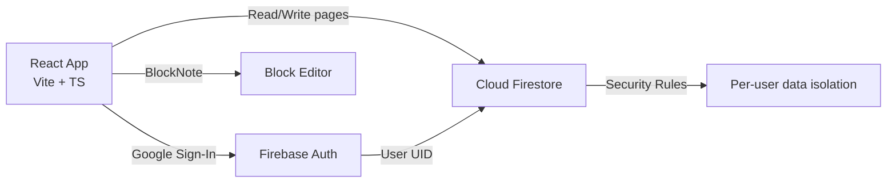

# Slate — Implementation Plan

> A Notion-like, block-based note-taking app. Purely client-side, connecting directly to Firebase with Google login.

## Tech Stack

| Layer | Choice | Rationale |
|---|---|---|
| **Build / Dev** | Vite | Fast HMR, first-class TypeScript support |
| **UI Framework** | React 18 + TypeScript | Type-safe, component-driven |
| **Editor** | [BlockNote](https://www.blocknotejs.org/) | Block-based editor with slash commands (`/`), drag-and-drop, and rich formatting out of the box |
| **Styling** | Tailwind CSS v4 | Rapid UI building per your plan |
| **Auth** | Firebase Auth (Google Sign-In) | Zero-backend auth flow |
| **Database** | Cloud Firestore | Real-time sync, offline support, per-user security rules |
| **Hosting** | Firebase Hosting (optional) | Free tier, one-command deploy |

---

## Architecture Overview



This is a **purely client-side SPA** — no backend server. Firebase handles auth and storage directly from the browser.

---

## Phase 1: Project Scaffolding & Auth

### 1.1 Initialize Project
- Scaffold with `npx -y create-vite@latest ./ --template react-ts`
- Install dependencies:
  - `@blocknote/core`, `@blocknote/react`, `@blocknote/mantine` (BlockNote + its UI)
  - `firebase` (Firebase SDK)
  - `tailwindcss` (v4)
  - `react-router-dom` (client-side routing)
  - `@mantine/core` (BlockNote's default UI layer depends on Mantine)

### 1.2 Firebase Setup
- Create a Firebase project config file (`src/config/firebase.ts`)
- Initialize Firebase App, Auth, and Firestore instances
- User will need to provide their own Firebase project credentials (via `.env` or config)

### 1.3 Google Authentication
- **Component:** `LoginPage.tsx` — full-screen login with Google sign-in button
- **Component:** `AuthProvider.tsx` — React context wrapping `onAuthStateChanged`
- **Hook:** `useAuth()` — returns `{ user, loading, signIn, signOut }`
- **Route guard:** `ProtectedRoute.tsx` — redirects unauthenticated users to login

### Deliverable
- User can sign in with Google and see a protected dashboard

---

## Phase 2: Page Management (CRUD)

### 2.1 Firestore Data Model

```
/users/{uid}/pages/{pageId}
  ├── title: string
  ├── content: JSON (BlockNote document)
  ├── icon: string (emoji)
  ├── createdAt: Timestamp
  ├── updatedAt: Timestamp
  └── isArchived: boolean
```

### 2.2 Firestore Security Rules
```javascript
rules_version = '2';
service cloud.firestore {
  match /databases/{database}/documents {
    match /users/{userId}/pages/{pageId} {
      allow read, write: if request.auth != null && request.auth.uid == userId;
    }
  }
}
```

### 2.3 Data Layer
- **Service:** `src/services/pages.ts` — Firestore CRUD operations:
  - `createPage(uid)` → returns new page ID
  - `getPages(uid)` → list all pages (title, icon, updatedAt)
  - `getPage(uid, pageId)` → full page with content
  - `updatePage(uid, pageId, data)` → partial update (title, content)
  - `deletePage(uid, pageId)` → soft delete (set `isArchived: true`)

### Deliverable
- Pages can be created, listed, opened, updated, and archived

---

## Phase 3: Core UI — Sidebar + Editor

### 3.1 Layout
```
┌──────────────────────────────────────────┐
│  Sidebar (250px)  │    Editor Area       │
│                   │                      │
│  🔍 Search        │  Page Title (h1)     │
│  ──────────────── │                      │
│  📄 Page 1        │  BlockNote Editor    │
│  📄 Page 2        │  (slash commands,    │
│  📄 Page 3        │   drag & drop,       │
│  ...              │   rich blocks)       │
│                   │                      │
│  ──────────────── │                      │
│  + New Page       │                      │
│  👤 User / Logout │                      │
└──────────────────────────────────────────┘
```

### 3.2 Components

| Component | Description |
|---|---|
| `AppLayout.tsx` | Main layout with sidebar + editor area |
| `Sidebar.tsx` | Collapsible sidebar with page list, search, new page button |
| `PageList.tsx` | Lists pages with icon + title, click to navigate |
| `PageListItem.tsx` | Single page entry with hover actions (rename, delete) |
| `PageEditor.tsx` | BlockNote editor + editable title input |
| `SearchBar.tsx` | Client-side search/filter over page titles |
| `UserMenu.tsx` | Avatar, display name, sign-out button |

### 3.3 Routing
```
/login          → LoginPage
/               → AppLayout (redirect to last page or empty state)
/page/:pageId   → AppLayout → PageEditor
```

### 3.4 Editor Integration
- Use `@blocknote/react`'s `useCreateBlockNote()` hook
- Initialize with saved content from Firestore (`initialContent`)
- Auto-save on `onChange` with **debounce (1.5s)** to avoid excessive writes
- Support default block types: paragraph, headings, lists, to-do, code, image, table, callout

### Deliverable
- Fully functional Notion-like editor with sidebar navigation

---

## Phase 4: Polish & UX

### 4.1 Visual Design
- **Dark mode** with a rich, modern aesthetic (dark sidebar, slightly lighter editor)
- **Smooth transitions** — sidebar collapse/expand, page switching
- **Hover micro-animations** on sidebar items
- **Empty state** — friendly illustration + "Create your first page" CTA
- **Loading skeletons** while Firestore data loads

### 4.2 Features
- **Emoji picker** for page icons (lightweight inline picker)
- **Keyboard shortcuts:** `Cmd+N` (new page), `Cmd+\\` (toggle sidebar)
- **Responsive:** sidebar auto-collapses on narrow screens
- **Unsaved indicator** — subtle dot while auto-save is pending
- **Toast notifications** — save confirmation, errors

### 4.3 Performance
- Lazy-load the editor component (`React.lazy`)
- Firestore query pagination if page count grows large
- Memoize page list to avoid re-renders

### Deliverable
- A polished, premium-feeling app ready for daily use

---

## File Structure

```
slate/
├── index.html
├── package.json
├── tailwind.config.ts
├── tsconfig.json
├── vite.config.ts
├── .env.example              # Firebase config template
├── public/
│   └── favicon.svg
├── src/
│   ├── main.tsx              # Entry point
│   ├── App.tsx               # Router setup
│   ├── index.css             # Tailwind imports + global styles
│   ├── config/
│   │   └── firebase.ts       # Firebase init
│   ├── contexts/
│   │   └── AuthContext.tsx    # Auth provider + hook
│   ├── components/
│   │   ├── AppLayout.tsx
│   │   ├── Sidebar.tsx
│   │   ├── PageList.tsx
│   │   ├── PageListItem.tsx
│   │   ├── PageEditor.tsx
│   │   ├── SearchBar.tsx
│   │   ├── UserMenu.tsx
│   │   ├── LoginPage.tsx
│   │   ├── ProtectedRoute.tsx
│   │   └── EmptyState.tsx
│   ├── services/
│   │   └── pages.ts          # Firestore CRUD
│   ├── hooks/
│   │   ├── useAuth.ts
│   │   ├── usePages.ts       # Page list hook
│   │   └── usePage.ts        # Single page hook
│   └── types/
│       └── index.ts          # Shared TypeScript types
└── firestore.rules           # Security rules (for deployment)
```

---

## Implementation Order

| Step | Phase | Estimated Effort |
|---|---|---|
| 1 | Scaffold Vite + Tailwind + deps | ~10 min |
| 2 | Firebase config + Auth + Login page | ~20 min |
| 3 | Firestore data model + CRUD service | ~15 min |
| 4 | Sidebar + page list + routing | ~25 min |
| 5 | BlockNote editor integration + auto-save | ~20 min |
| 6 | Polish: dark mode, animations, empty states | ~20 min |
| 7 | Keyboard shortcuts, emoji picker, responsive | ~15 min |

---

## Prerequisites (User Action Required)

> [!IMPORTANT]
> Before building, you'll need to:
> 1. **Create a Firebase project** at [console.firebase.google.com](https://console.firebase.google.com)
> 2. **Enable Google Sign-In** under Authentication → Sign-in method
> 3. **Create a Firestore database** (start in test mode, we'll add rules later)
> 4. **Copy your Firebase config** (apiKey, authDomain, projectId, etc.) — we'll store these in a `.env` file

---

## Open Questions

1. **Do you want to set up Firebase now, or should I scaffold with placeholder config and you'll fill in credentials later?**
2. **Any preference on Tailwind CSS version?** Your plan says Tailwind — I'll use **v4** (latest) unless you prefer v3.
3. **Do you want nested pages / sub-pages** (like Notion's tree structure), or flat pages for v1?
4. **Should I include a trash/archive view**, or just soft-delete for now?
