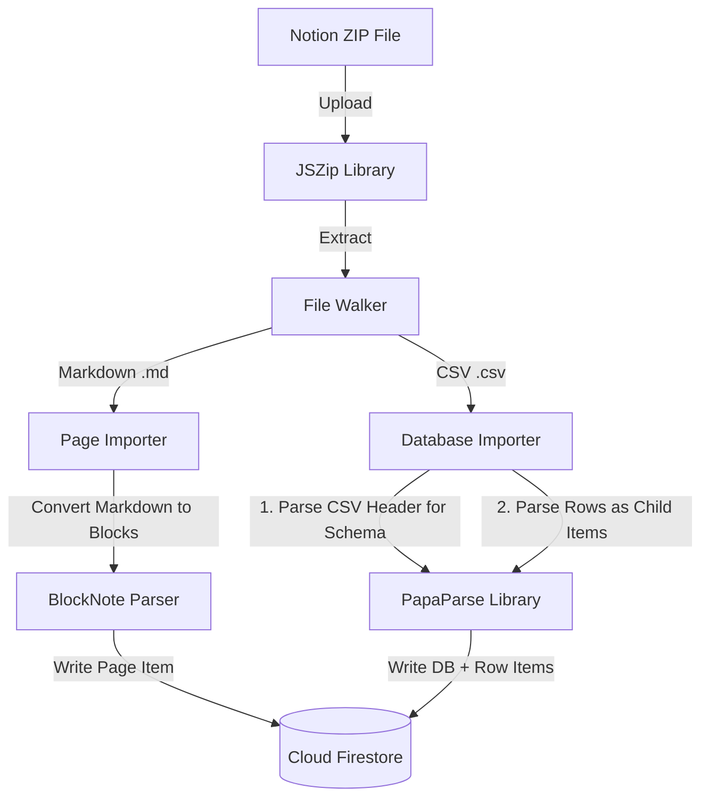

# Notion to Slate Migration Plan

> Design and implementation roadmap for importing data from Notion (Markdown & CSV ZIP exports) into Slate.

---

## 1. Notion Export Format

Notion allows users to export their workspace as a **Markdown & CSV ZIP archive**. The structure looks like this:

```
workspace-export.zip
├── Getting Started 1a2b3c4d5e6f.md               # Standard Page
├── Personal Home 2b3c4d5e6f7a.md                # Standard Page
└── Tasks Database 3c4d5e6f7a8b/                 # Database Folder
    ├── Tasks Database 3c4d5e6f7a8b.csv          # Database Schema & Rows
    ├── Implement login 4d5e6f7a8b9c.md          # Row Page Content
    └── Fix navbar bug 5e6f7a8b9c0d.md           # Row Page Content
```

---

## 2. Core Importer Architecture

To keep the application **purely client-side**, the import logic will run entirely in the browser:



---

## 3. Data Conversion Mapping

### A. Pages (Markdown to BlockNote Blocks)
* **Notion Headings (`#`, `##`, `###`)** → BlockNote Headings (`heading1`, `heading2`, `heading3`)
* **List items (`*`, `-`, `1.`)** → BlockNote lists (`bulletListItem`, `numberedListItem`)
* **Checkboxes (`- [ ]`, `- [x]`)** → BlockNote tasks (`toDoListItem`)
* **Images (``)** → BlockNote image blocks
* **Text formatting (`**bold**`, `*italic*`, ``code``)** → BlockNote inline styles

### B. Databases (CSV to Slate Items)
1. **Database Creation**: Create a parent item `type: "database"` using the CSV name.
2. **Schema Inference**: Parse the first row (headers). Infer property types based on values:
   - If values contain `true`/`false` → `checkbox`
   - If values are numbers → `number`
   - If values match YYYY-MM-DD or ISO dates → `date`
   - Otherwise → `text` or `select` (if unique values count is small)
3. **Row Creation**: Map each row in the CSV to a Slate item with `parentId: databaseId`.
4. **Sub-page Binding**: Read corresponding `.md` files in the database folder and parse them as block content for each row page.

---

## 4. Required Packages

We need to add two lightweight client-side parsing libraries:
* **`jszip`**: For extracting the ZIP archive in memory.
* **`papaparse`**: For fast, robust CSV parsing.

```bash
npm install jszip papaparse
npm install -D @types/papaparse
```

---

## 5. Implementation Phases

### Phase A: Setup & ZIP Upload (~1 hr)
- Create `src/components/shared/ImporterModal.tsx`.
- Implement drag-and-drop file upload target for `.zip` files.
- Integrate `jszip` to extract files in memory and build a folder structure tree.

### Phase B: Markdown (Page) Importer (~1.5 hrs)
- Build a Markdown-to-BlockNote JSON parser helper.
- Iterate through top-level `.md` files, convert them, and insert them into Firestore as `type: "page"` items.

### Phase C: CSV (Database) Importer (~2 hrs)
- Integrate `papaparse` to process `.csv` files.
- Extract columns and map them to Slate `PropertyDefinition` objects.
- Insert the parent database item first.
- Read CSV rows, match them with any corresponding sub-page `.md` files, and batch-write row items to Firestore.

### Phase D: UX & Polish (~1 hr)
- Add a progress bar (e.g. *Importing page 3 of 10...*).
- Show summary toast on completion: *"Successfully imported 14 pages and 3 databases!"*.

---

## 6. Accessing via Sidebar

We will place an **"Import from Notion"** button at the bottom of the sidebar. 

```
┌─────────────────────────────────┐
│  ...                            │
│  ───────────────────────────────│
│  + New Page                     │
│  ◫ New Database                 │
│  📥 Import from Notion          │  <-- Click opens ImporterModal
│  ───────────────────────────────│
│  👤 User / Logout               │
└─────────────────────────────────┘
```
